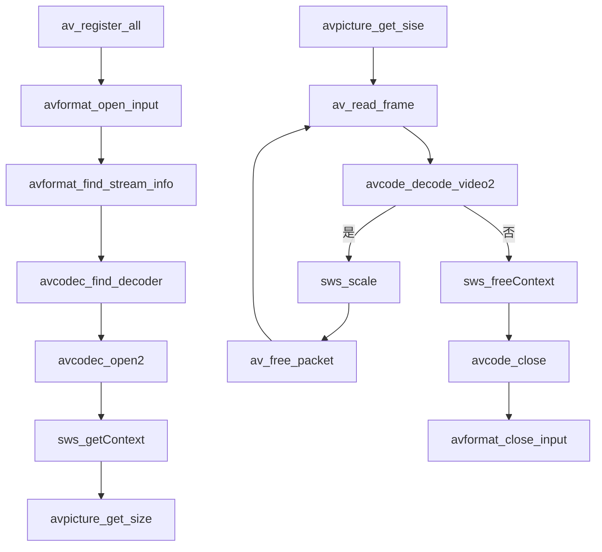

# opengl数学

$$\begin{Bmatrix}
{A_{x}}\\
{A_{y}}\\
{A_{z}}\\
\end{Bmatrix}$$ * $$\begin{Bmatrix}
{B_{x}}\\
{B_{y}}\\
{B_{z}}\\
\end{Bmatrix}$$ =$$\begin{Bmatrix}
{A_{x}}{\cdot}{B_{z}}-{A{z}}{\cdot}{B_{y}}\\
{A_{y}}{\cdot}{B_{x}}-{A{x}}{\cdot}{B_{z}}\\
{A_{z}}{\cdot}{B_{y}}-{A{y}}{\cdot}{B_{z}}\\
\end{Bmatrix}$$

* 点与矩阵相乘

$$\begin{bmatrix} 
{AX} + {BY} + {CZ} + {D}\\
{EX} + {FY} + {GZ} + {H}\\
{IX} + {JY} + {KZ} + {L}\\
{MX} + {NY} + {OZ} + {H}\\
\end{bmatrix} = \begin{bmatrix} 
{A} & {B} & {C} & {D}\\
{E} & {F} & {G} & {H}\\
{I} & {J} & {K} & {L}\\
{M} & {N} & {O} & {P}\\
\end{bmatrix} * \begin{bmatrix} 
{X}\\
{Y}\\
{Z}\\
{I}\\
\end{bmatrix}$$ 

* 加法

$$\begin{Bmatrix} 
{A+a} & {B+b} & {C+c} & {D+d}\\
{E+e} & {F+f} & {G+g} & {H+h}\\
{I+i} & {J+j} & {K+k} & {L=l}\\
{M+m} & {N+n} & {O+o} & {P+p}\\
\end{Bmatrix} = \begin{Bmatrix} 
{A} & {B} & {C} & {D}\\
{E} & {F} & {G} & {H}\\
{I} & {J} & {K} & {L}\\
{M} & {N} & {O} & {P}\\
\end{Bmatrix} + \begin{Bmatrix} 
{a} & {b} & {c} & {d}\\
{e} & {f} & {g} & {h}\\
{i} & {j} & {k} & {l}\\
{m} & {n} & {o} & {p}\\
\end{Bmatrix}$$

* 矩阵相乘

$$\begin{bmatrix} 
{A} & {B} & {C} & {D}\\
{E} & {F} & {G} & {H}\\
{I} & {J} & {K} & {L}\\
{M} & {N} & {O} & {P}\\
\end{bmatrix} * \begin{bmatrix} 
{a} & {b} & {c} & {d}\\
{e} & {f} & {g} & {h}\\
{i} & {j} & {k} & {l}\\
{m} & {n} & {o} & {p}\\
\end{bmatrix} = \begin{bmatrix} 
{A_{a}} + {B_{e}} + {C_{i}} + {C_{m}}&{Ab} + {Bf} + {Cj} + {Dn}&{Ad} + {Bh} + {cl} + {Dp} \\
{E_{a}} + {F_{e}} + {G_{i}} + {C_{m}}&{Eb} + {Ff} + {Gj} + {Hn}&{Ed} + {Fh} + {Gl} + {Hp} \\
{I_{a}} + {J_{e}} + {K_{i}} + {M_{m}}&{Ib} + {Jf} + {Kj} + {Ln}&{Ld} + {Jh} + {Kl} + {Lp} \\
{M_{a}} + {N_{e}} + {O_{i}} + {P_{m}}&{Mb} + {Nf} + {Oj} + {Pn}&{Md} + {Nh} + {Ol} + {Pp} \\
\end{bmatrix}$$ 

* 矩阵平移

$$\begin{pmatrix} 
{X} + {T_{x}} \\
{Y} + {T_{y}} \\
{Z} + {T_{z}} \\
   {1}\\
\end{pmatrix} = \begin{bmatrix} 
{1} & {0} & {0} & {T_{x}}\\
{0} & {1} & {0} & {T_{y}}\\
{0} & {0} & {1} & {T_{z}}\\
{0} & {0} & {0} & {1}\\
\end{bmatrix} X \begin{pmatrix} 
{X}\\
{Y}\\
{Z}\\
{1}\\
\end{pmatrix}$$ 

* 矩阵缩放

$\begin{pmatrix} 
{X} * {T_{x}} \\
{Y} * {T_{y}} \\
{Z} * {T_{z}} \\
   {1}\\
\end{pmatrix} = \begin{bmatrix} 
{1} & {0} & {0} & {T_{x}}\\
{0} & {1} & {0} & {T_{y}}\\
{0} & {0} & {1} & {T_{z}}\\
{0} & {0} & {0} & {1}\\
\end{bmatrix} X \begin{pmatrix} 
{X}\\
{Y}\\
{Z}\\
{1}\\
\end{pmatrix}$

* 围绕X轴旋转rfa度

$$\begin{pmatrix} 
{X}^{\prime}\\
{Y}^{\prime}\\
{Z}^{\prime}\\
   {1}\\
\end{pmatrix} = \begin{bmatrix} 
{1} & {0} & {0} & {0}\\
{0} & {\cos}{\theta} & {-{\sin}{\theta}} & {0}\\
{0} & {\sin}{\theta} & {\cos}{\theta} & {0}\\
{0} & {0} & {0} & {1}\\
\end{bmatrix} X \begin{pmatrix} 
{X}\\
{Y}\\
{Z}\\
{1}\\
\end{pmatrix}$$ 

* 围绕Y旋转rfa度

$\begin{pmatrix} 
{X}^{\prime}\\
{Y}^{\prime}\\
{Z}^{\prime}\\
   {1}\\
\end{pmatrix} = \begin{bmatrix} 
{\cos}{\theta} & {0} & {\sin}{\theta} & {0}\\
{0} & {1} & {0} & {0}\\
{-{\sin}{\theta}} & {0} & {\cos}{\theta} & {0}\\
{0} & {0} & {0} & {1}\\
\end{bmatrix} X \begin{pmatrix} 
{X}\\
{Y}\\
{Z}\\
{1}\\
\end{pmatrix}$

围绕Z旋转rfa度

$\begin{pmatrix} 
{X}^{\prime}\\
{Y}^{\prime}\\
{Z}^{\prime}\\
   {1}\\
\end{pmatrix} = \begin{bmatrix} 
{\cos}{\theta} & {-{\sin}{\theta}} & {0} & {0}\\
{\sin}{\theta} & {\cos}{\theta} & {0} & {0}\\
{0} & {0} & {1} & {0}\\
{0} & {0} & {0} & {1}\\
\end{bmatrix} X \begin{pmatrix} 
{X}\\
{Y}\\
{Z}\\
{1}\\
\end{pmatrix}$

* 向量  
  $$V \bullet W = |\vec V||W|$$
  
  $$\cos(\theta)=\frac{\vec V\bullet W}{\vec V||W|}$$
  
  $$\cos(\theta)=V \bullet W$$
  
  $$\theta=arccos(V \bullet W)$$

